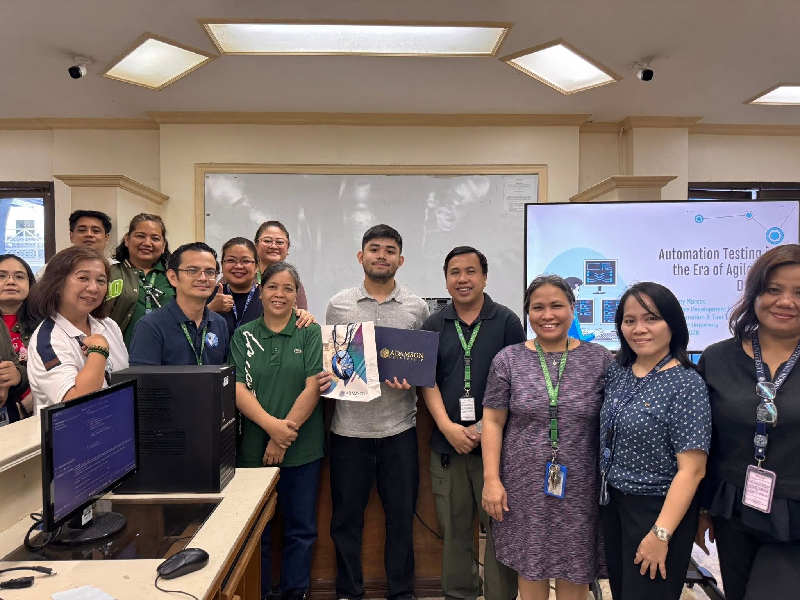
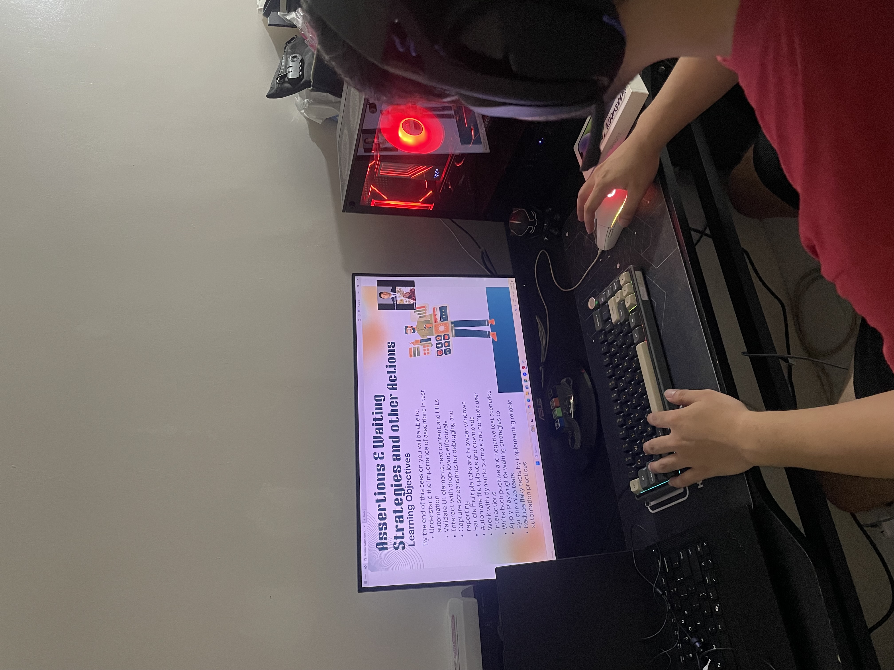
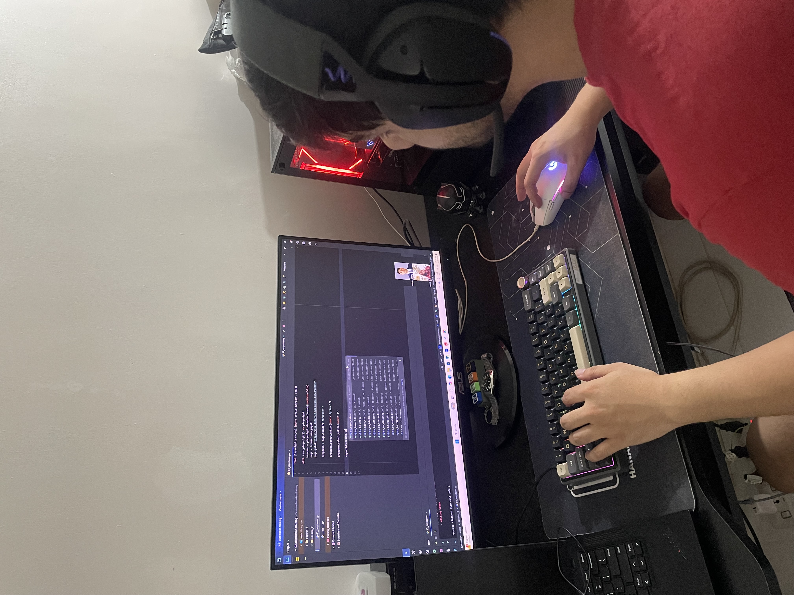

## 🎤 Seminar: Automation Testing in the Era of Agile and DevOps

**Resource Speaker — Adamson University College of Computing and Information Technology (CCIT)**

[📸 View Event Details](https://www.facebook.com/share/p/1dkokHNbZr/)

* Conducted a technical seminar on test automation, Agile, and DevOps** for faculty members from the IT&IS and Computer Science departments.
* Discussed the fundamentals of automation testing, its role in modern software development, and how it fits into Agile and DevOps environments.
* Shared practical industry experience, automation approaches, and best practices** from professional QA and automation work.
* Led a hands-on workshop where participants developed and executed basic automated test scripts.
* Facilitated an open forum and Q&A focused on **real-world automation testing practices.

## 🎓 Playwright + Python Automation Testing

**Technical Trainer**

* Conduct hands-on Playwright + Python automation training** covering the fundamentals of UI automation through building a simple automation framework.
* Deliver a structured 4-session training program with live discussions, hands-on exercises, sample code, and Q&A.
* Cover Playwright, Python, Pytest, Page Object Model (POM), assertions, locators, waiting strategies, test organization, and Allure reporting.
* Guide participants in building and organizing a mini automation framework using reusable page objects, utilities, and configuration.
* Include practical exercises based on real-world automation workflows and common testing scenarios.
* Share best practices for writing automation that is **maintainable, reusable, and less prone to flaky tests.

### Training Coverage

**Session 1 — Playwright & Python Fundamentals**

* Test automation fundamentals
* Playwright and Python setup
* Locators and web interactions
* Hands-on login and form automation

**Session 2 — Assertions & Reliable Tests**

* UI, text, URL, and page validations
* Positive and negative scenarios
* Playwright auto-waiting
* Dynamic elements and explicit waits
* Avoiding flaky tests

**Session 3 — Pytest & Page Object Model**

* Test structure and organization
* Automated test suites
* Page Object Model
* Reusable page objects
* Maintainability and test organization

**Session 4 — Mini Automation Framework**

* Framework structure
* Pages, tests, and utilities
* Configuration management
* Allure reporting
* Automation best practices
* Final end-to-end automation exercise

### Training Outcome

Participants finish the training with hands-on experience creating Playwright + Python automated tests**, organizing tests with Pytest and POM**, integrating Allure reporting, and building a simple automation framework.

